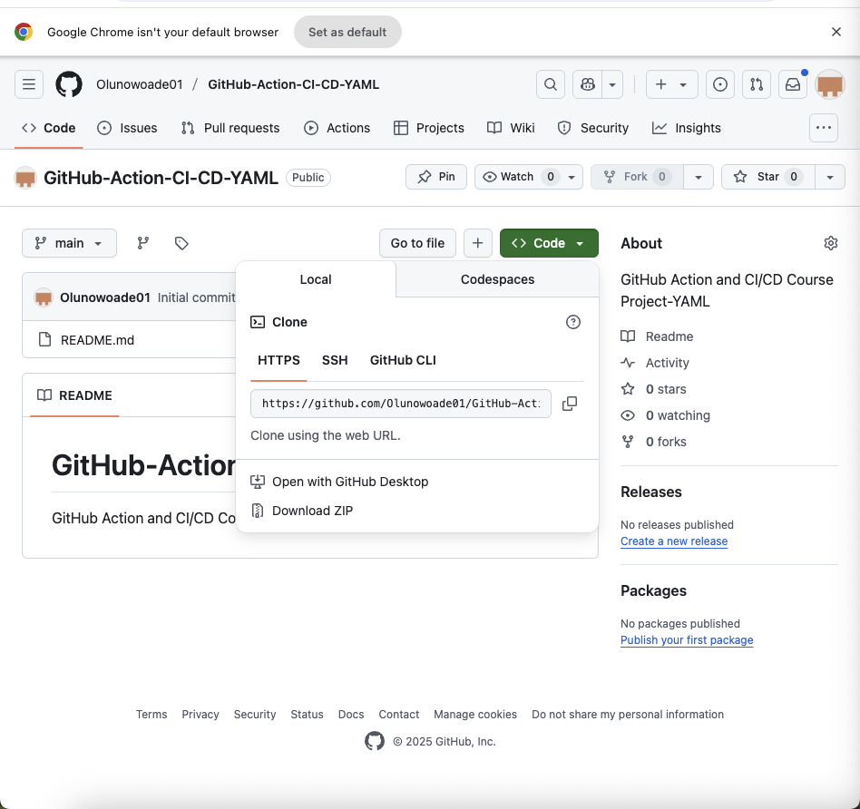
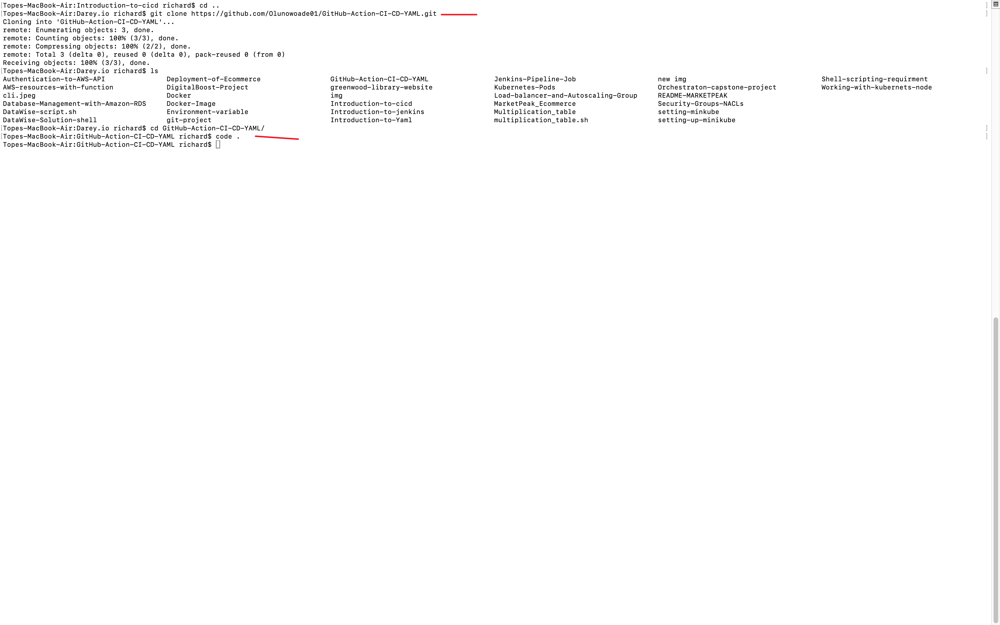
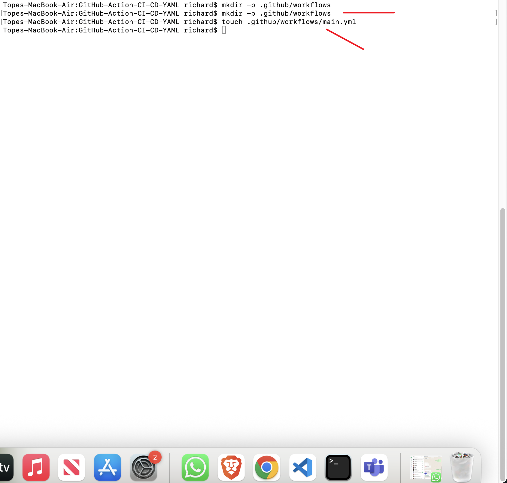
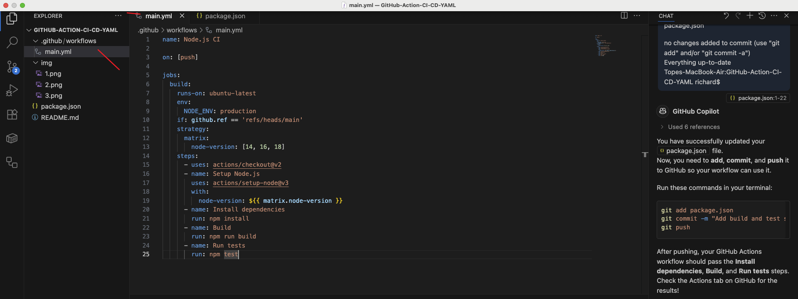
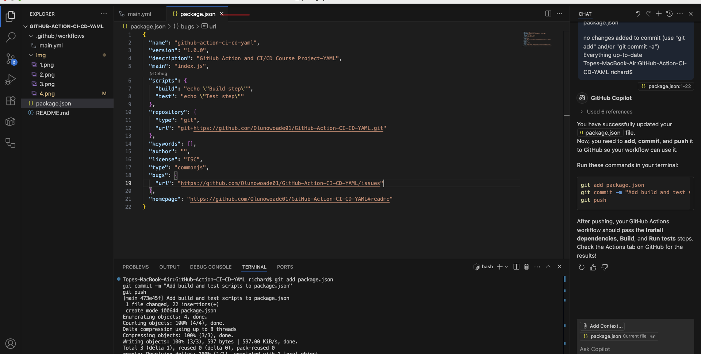
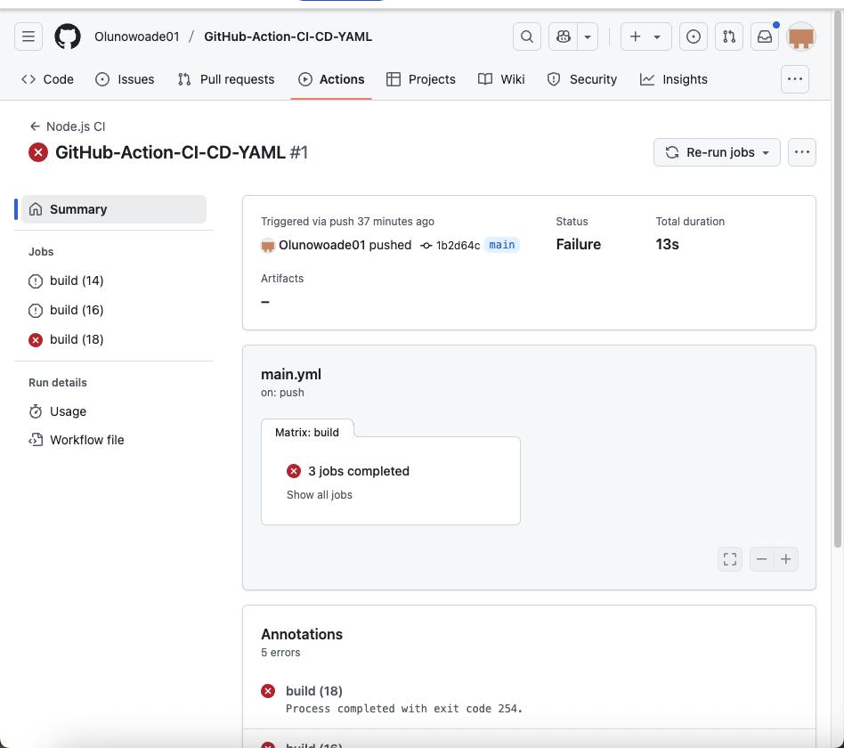
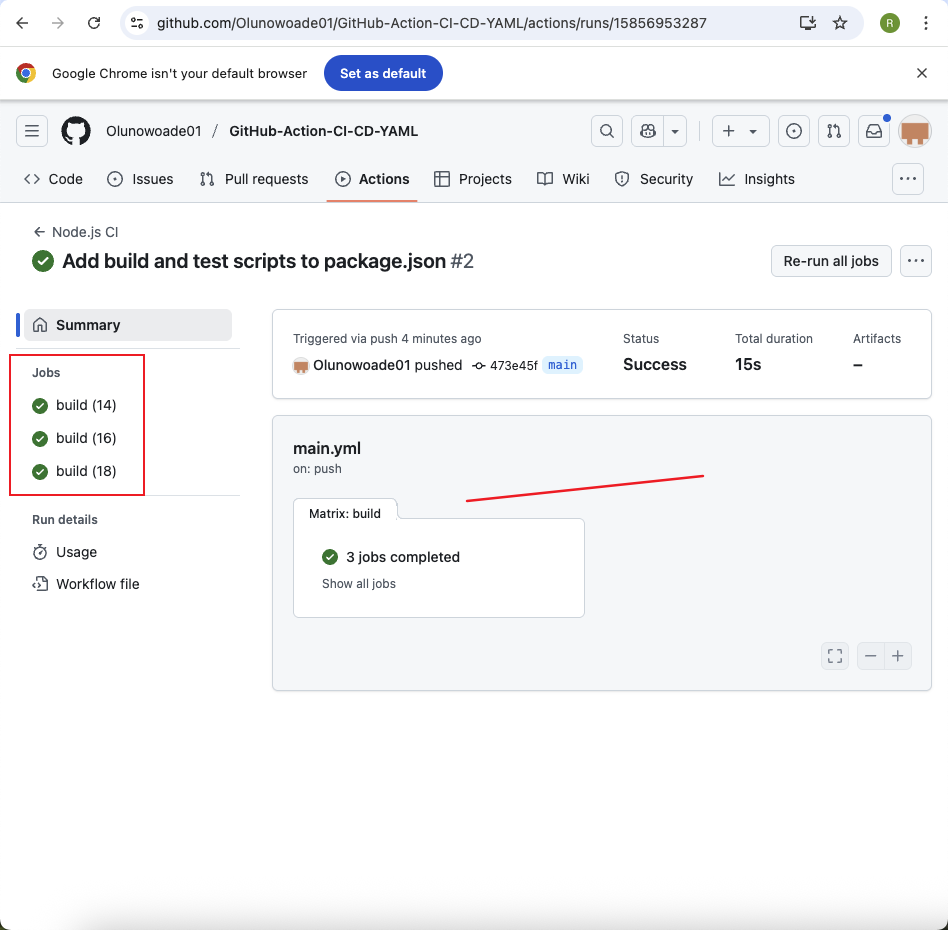
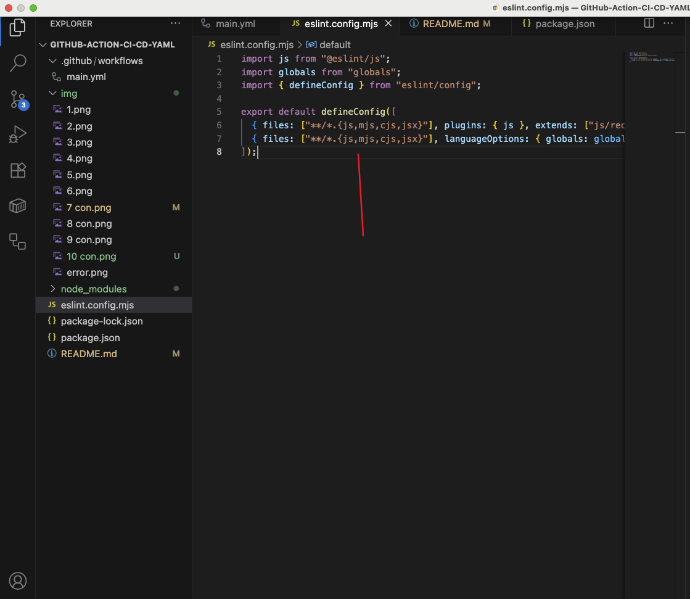

# GitHub-Action-CI-CD-YAML

GitHub Action and CI/CD Course Project - YAML

# Project Topic
- GitHub Actions workflow that automates the deployment of a Node.js application to a production environment. 

 # Step 1: Creating my repository**  

 - starting  by creating a new repository on GitHub. This is where all my project files and workflow configurations will be stored.
    
   

 # Step 2: Clone the repository

 - Next i  clone the repository to my local machine using `git clone`. This allows me to work on my project files locally before pushing changes back to GitHub.
    

  

# Step 3: Creating a workflow 

- I create a workflow file (e.g., `.github/workflows/main.yml`). This YAML file defines the automation steps that GitHub Actions will run, such as installing dependencies, building, and testing my code.
    
  

# Step 4: Adding script to the workflow

- I add steps in my workflow file to automate tasks. Common steps include checking out my code, setting up Node.js, installing dependencies with `npm install`, running build scripts, and executing tests.*
    
  

# Step 5: Open package.json and add script 

- I edit my `package.json` file to ensure it contains the necessary `build` and `test` scripts. These scripts are called by the workflow to build and test my project automatically.

    
  

# Step 6: Facing error

*If there is a problem (such as a missing file or a script error), the workflow will fail. i can view detailed error logs in the GitHub Actions tab to help me troubleshoot and fix the issue.

    
  

# Step 7: Fixing and working 

 - After fixing the errors, i push my changes again. The workflow is now complete successfully, showing green check marks for each step in the Actions tab.
    
 

# Project Topic

**Implementing Continuous Integration and Code Quality Checks for a Node.js Application using GitHub Actions**

This project demonstrates how to automate the build, test, and code quality analysis process for a Node.js application using GitHub Actions. The workflow includes matrix builds, dependency caching, and linting with ESLint to ensure code quality and compatibility across multiple Node.js versions.

# Step 8: I Update Workflow for CI/CD

- I updated my `main.yml` to include:
  - Matrix builds (test on multiple Node.js versions)
  - Caching node modules (for faster builds)
  - Linting/code quality check (using ESLint)

  

# Step 9: I Install and Configure ESLint

- I installed ESLint and initialized the config using:
  `
  npm install eslint --save-dev
  npx eslint --init
  `
  

# Step 10: The ESLint Config Success

- The `eslint.config.mjs` file was successfully created and I updated the script inside to make it work for my project.

  
  

# Step 11: Final Check

- After checking all the scripts and pushing, my GitHub Actions workflow is working properly.

 # Project Summary

This project provides a practical guide to implementing CI/CD and automated code quality checks for a Node.js application using GitHub Actions and YAML. By following each step, I learned how to automate my development workflow—from repository setup, through workflow creation, to troubleshooting and successful build verification.

With this setup:
- Every code change is automatically built, linted, and tested across multiple Node.js versions.
- Dependency caching speeds up the workflow.
- ESLint is integrated to enforce code quality standards.
- Errors are caught early, and the workflow status is visible in the GitHub Actions tab.

The visual steps and explanations make it easy for anyone to understand and replicate a modern CI/CD pipeline with code quality checks for their own projects.